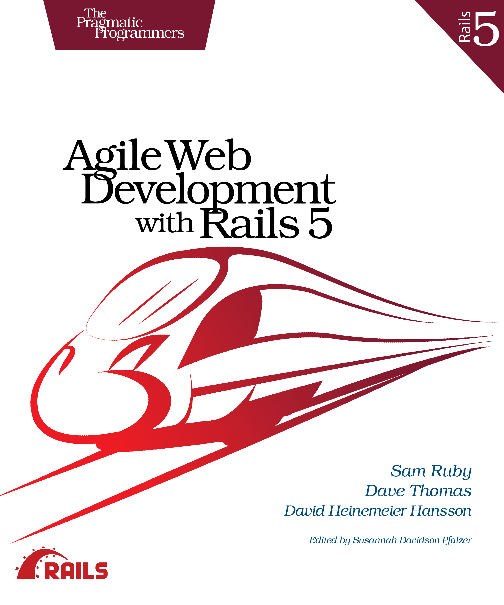

#  Lexxeous's Depot:
##### An interpretation of the sample application contained in "Agile Web Development with RoR5"
> -- by Sam Ruby, Dave Thomas, & David Heinemeier Hansson
# 

## Depenencies
 * Ruby 2.5.0
 * Rails 5.1.6

## System dependencies

## Configuration

## Database creation

## Database initialization

## How to run the test suite

## Services (job queues, cache servers, search engines, etc.)

## Deployment instructions
